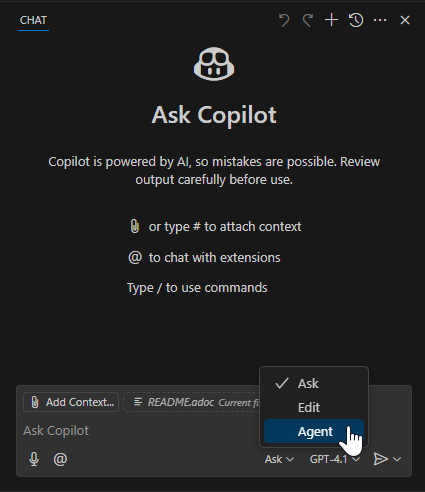
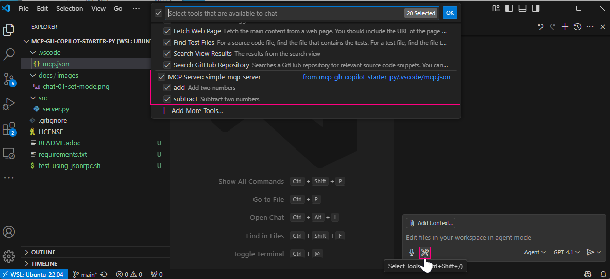
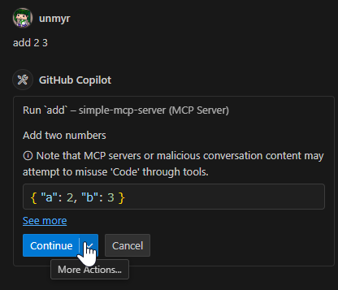

ifndef::leveloffset[]
:toc: left
:toclevels: 3
endif::[]
ifndef::env-github[]
:icons: font
endif::[]

== Python MCP Server Example on GitHub Copilot

This document describes how to create a Python MCP server example that can be used with GitHub Copilot.

=== Files
The following files are used in this example. The files in the `src` directory are the MCP server source code, and the files in the `test_stdio_tool_*.py` and `test_stdio_tool_*.sh` files are used for testing the MCP server.

[source,plaintext]
----
.
├── .gitignore ... used for git
├── .python-version ... used for uv
├── .vscode
│   ├── mcp.json ... used for GitHub Copilot
│   └── settings.json ... used for VS-Code
├── LICENSE
├── README.adoc
├── docs
│   └ ...
├── pyproject.toml ... used for uv
├── requirements.txt ... used for pip
├── src
│   ├── tool_reincarnate.py
│   └── tool_simple_math.py
├── test_stdio_tool_reincarnate.py ... used for testing the reincarnate tool
├── test_stdio_tool_reincarnate.sh ... used for testing the reincarnate tool
├── test_stdio_tool_simple_math.py ... used for testing the simple math tool
├── test_stdio_tool_simple_math.sh ... used for testing the simple math tool
└── uv.lock ... used for uv
----

=== Install using the system Python (without a virtual environment)

. Install pip packages
+
[source,shell]
----
python -m pip install -r requirements.txt --user
----

. Create a `settings.json` file in the `.vscode` directory and enter the following content.
+
[source,json]
..vscode/mcp.json
----
{
  "inputs": [],
  "servers": {
    "simple-mcp-server": {
      "command": "python",
      "type": "stdio",
      "args": ["${workspaceFolder}/src/tool_simple_math.py"],
      "env": {}
    }
  }
}
----

=== Install using venv and pip
This section describes how to install the MCP server using a virtual environment (venv).

1. Create a virtual environment
+
[source,shell]
----
python -m venv .venv
----

2. Activate the virtual environment
+
[source,shell]
----
source .venv/bin/activate
----

3. Create a `settings.json` file in the `.vscode` directory and enter the following content.
+
[source,json]
..vscode/mcp.json
----
{
  "inputs": [],
  "servers": {
    "simple-mcp-server": {
      "command": "mcp",
      "type": "stdio",
      "args": ["run", "${workspaceFolder}/src/tool_simple_math.py"],
      "env": {}
    }
  }
}
----

4. Install the MCP server
+
[source,shell]
----
python -m pip install uv --user
----

.Uninstall virtual environment
. Deactivate the virtual environment
+
[source,shell]
----
deactivate
----

. Remove the virtual environment directory
+
[source,shell]
----
rm -rf .venv
----

=== Install using venv and uv
This section describes how to install the MCP server using a virtual environment (venv) and the `uv` package.

. Install the `uv` package +
See: https://docs.astral.sh/uv/getting-started/installation/[Installling uv]
+
[source,shell]
----
python -m pip install uv --user
----

. Create a virtual environment using `uv`
+
[source,shell]
----
uv venv
----

. Initialize uv project
+
[source,shell]
----
uv init --bare .
----

. Install fastmcp using `uv`
+
[source,shell]
----
uv add fastmcp
----

. Create a `settings.json` file in the `.vscode` directory and enter the following content.
+
[source,json]
..vscode/mcp.json
----
{
  "inputs": [],
  "servers": {
    "simple-mcp-server": {
      "command": "mcp",
      "type": "stdio",
      "args": ["run", "${workspaceFolder}/src/tool_simple_math.py"],
      "env": {}
    }
  }
}
----

.Uninstall virtual environment
. Deactivate the virtual environment
+
[source,shell]
----
deactivate
----

. Remove the virtual environment directory
+
[source,shell]
----
rm -rf .venv
----

=== Run MCP tool server on GitHub Copilot (easy method)
This section describes the procedure for checking the operation of the MCP server using GitHub Copilot.

1. Open the GitHub Copilot chat screen and switch to Agent mode.
+

2. You can check if the loading was successful by clicking the "Select Tools..." button.
+

3. Open the settings and ask the following question:
+
[source,plaintext]
----
add 2 3
----
+
.Asking the question

+
.Result of the question
image::docs/images/chat-04-result-add-2-3.png[]

=== SSE example
This section describes the procedure for checking the operation of the MCP server using SSE (Server-Sent Events).

1. Run MCP server
+
[source,shell]
----
python src/tool_reincarnate.py
----
+
[source,plaintext]
----
$ python src/tool_reincarnate.py 
[06/10/25 00:34:16] INFO     Starting MCP server 'sse-test' with transport 'sse' on http://0.0.0.0:3000/sse                                       tool_simple_math.py:1031
INFO:     Started server process [71599]
INFO:     Waiting for application startup.
INFO:     Application startup complete.
INFO:     Uvicorn running on http://0.0.0.0:3000 (Press CTRL+C to quit)
INFO:     127.0.0.1:53992 - "POST /sse HTTP/1.1" 405 Method Not Allowed
INFO:     127.0.0.1:53998 - "GET /sse HTTP/1.1" 200 OK
----

2. Add server from "Select Tools..." button:
+
[source,plaintext]
----
http://0.0.0.0:3000/sse
----

3. Open the settings and ask the following question:
+
[source,plaintext]
.Asking the question
----
Please tell Bob where I will be reincarnated.
----
+
[source,plaintext]
.Result of the question
----
Bob will be reincarnated as a brave lion.
----

If you want to write it in `.vscode/mcp.json`, it will have the following format:

[source,json]
----
{
  "inputs": [],
  "servers": {
    "my-remote-mcp-server-reincarnation": {
      "type": "sse",
      "url": "http://0.0.0.0:3000/sse"
    }
  }
}
----

=== Checking the operation of the MCP server alone (The hard way)
This section describes the procedure for checking the operation of the MCP server alone (without Copilot).  

Note:: This method requires understanding the MCP JSON-RPC protocol, so it is more difficult than checking via GitHub Copilot.

1. Run MCP server
+
[source,shell]
----
python src/tool_simple_math.py
----

2. Install `expect` package
+
[source,shell]
----
sudo apt install expect
----

3. Run test script
+
[source,shell]
----
./test_stdio_tool_simple_math.sh
----
+
.Result of the test script
[source,plaintext]
----
$ ./test_stdio_tool_simple_math.sh
spawn python src/tool_simple_math.py
{"jsonrpc": "2.0", "id": 0, "method": "initialize", "params": {"protocolVersion": "2024-11-05", "capabilities": {}, "clientInfo": {"name": "whatever", "version": "0.0.0"}}}
Received response to initialize
{"jsonrpc":"2.0","id":0,"result":{"protocolVersion":"2024-11-05","capabilities":{"experimental":{},"prompts":{"listChanged":false},"resources":{"subscribe":false,"listChanged":false},"tools":{"listChanged":false}},"serverInfo":{"name":"simple-mcp-server","version":"1.9.2"}}}

Received response to tools/list
{"jsonrpc":"2.0","method":"notifications/initialized","params":{}}
{"jsonrpc": "2.0", "id": 0, "method": "tools/list", "params":{}}
{"jsonrpc":"2.0","id":0,"result":{"tools":[{"name":"add","description":"Add two numbers","inputSchema":{"properties":{"a":{"title":"A","type":"integer"},"b":{"title":"B","type":"integer"}},"required":["a","b"],"title":"addArguments","type":"object"}},{"name":"subtract","description":"Subtract two numbers","inputSchema":{"properties":{"a":{"title":"A","type":"integer"},"b":{"title":"B","type":"integer"}},"required":["a","b"],"title":"subtractArguments","type":"object"}}]}}

Received response to tools/call
{"jsonrpc": "2.0", "id": 0, "method": "tools/call", "params":{"name": "add", "arguments": {"a": 1, "b": 3}}}
{"jsonrpc":"2.0","id":0,"result":{"content":[{"type":"text","text":"4"}],"isError":false}}

Received response to resources/list
{"jsonrpc": "2.0", "id": 0, "method": "resources/list", "params":{}}
{"jsonrpc":"2.0","id":0,"result":{"resources":[]}}

Received response to prompts/list
{"jsonrpc": "2.0", "id": 0, "method": "prompts/list"}
{"jsonrpc":"2.0","id":0,"result":{"prompts":[]}}
----
