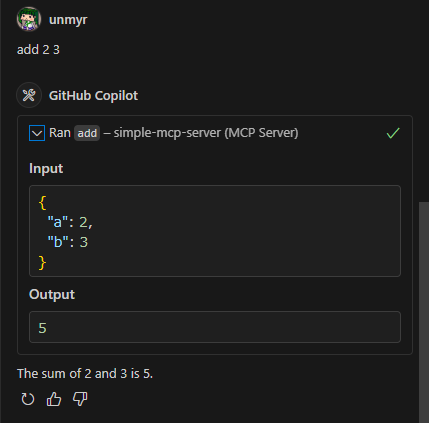

ifndef::leveloffset[]
:toc: left
:toclevels: 3
endif::[]
ifndef::env-github[]
:icons: font
endif::[]

== Python MCP Server Example on GitHub Copilot

=== Install

. Install pip packages
+
[source,shell]
----
python -m pip install -r requirements.txt --user
----

=== Checking operation on GitHub Copilot (easy method)
This section describes the procedure for checking the operation of the MCP server using GitHub Copilot.

1. Create a `settings.json` file in the `.vscode` directory and enter the following content.
+
[source,json]
.vscode .vscode/mcp.json
----
{
  "inputs": [],
  "servers": {
    "simple-mcp-server": {
      "command": "python",
      "type": "stdio",
      "args": ["${workspaceFolder}/src/tool_simple_math.py"],
      "env": {}
    }
  }
}
----

2. Open the GitHub Copilot chat screen and switch to Agent mode.
+

3. You can check if the loading was successful by clicking the "Select Tools..." button.
+
image::docs/images/chat-02-show-my-mcp-server.png[]

4. Open the settings and ask the following question:
+
[source,plaintext]
----
add 2 3
----
+
.Asking the question
image::docs/images/chat-03-ask-add-2-3.png[]
+
.Result of the question

=== SSE example
This section describes the procedure for checking the operation of the MCP server using SSE (Server-Sent Events).

1. Run MCP server
+
[source,shell]
----
python src/server_sse.py
----
+
[source,plaintext]
----
$ python src/server_sse.py 
[06/10/25 00:34:16] INFO     Starting MCP server 'sse-test' with transport 'sse' on http://0.0.0.0:3000/sse                                       tool_simple_math.py:1031
INFO:     Started server process [71599]
INFO:     Waiting for application startup.
INFO:     Application startup complete.
INFO:     Uvicorn running on http://0.0.0.0:3000 (Press CTRL+C to quit)
INFO:     127.0.0.1:53992 - "POST /sse HTTP/1.1" 405 Method Not Allowed
INFO:     127.0.0.1:53998 - "GET /sse HTTP/1.1" 200 OK
----

2. Add server from "Select Tools..." button:
+
[source,plaintext]
----
http://0.0.0.0:3000/sse
----

3. Open the settings and ask the following question:
+
[source,plaintext]
.Asking the question
----
Please tell Bob where I will be reincarnated.
----
+
[source,plaintext]
.Result of the question
----
Bob will be reincarnated as a brave lion.
----

If you want to write it in `.vscode/mcp.json`, it will have the following format:

[source,json]
----
{
  "inputs": [],
  "servers": {
    "my-remote-mcp-server-reincarnation": {
      "type": "sse",
      "url": "http://0.0.0.0:3000/sse"
    }
  }
}
----

=== Checking the operation of the MCP server alone (difficult method)
This section describes the procedure for checking the operation of the MCP server alone (without Copilot).  

Note:: This method requires understanding the MCP JSON-RPC protocol, so it is more difficult than checking via GitHub Copilot.

1. Run MCP server
+
[source,shell]
----
python src/tool_simple_math.py
----

2. Install `expect` package
+
[source,shell]
----
sudo apt install expect
----

3. Run test script
+
[source,shell]
----
./test_using_jsonrpc.sh
----
+
.Result of the test script
[source,plaintext]
----
$ ./test_using_jsonrpc.sh 
spawn python src/tool_simple_math.py
{"jsonrpc": "2.0", "id": 0, "method": "initialize", "params": {"protocolVersion": "2024-11-05", "capabilities": {}, "clientInfo": {"name": "whatever", "version": "0.0.0"}}}
{"jsonrpc":"2.0","id":0,"result":{"protocolVersion":"2024-11-05","capabilities":{"experimental":{},"prompts":{"listChanged":false},"resources":{"subscribe":false,"listChanged":false},"tools":{"listChanged":false}},"serverInfo":{"name":"simple-mcp-server","version":"1.9.2"}}}
Elapsed time for Initialize: 0 seconds
{"jsonrpc":"2.0","method":"notifications/initialized","params":{}}
{"jsonrpc": "2.0", "id": 0, "method": "tools/list", "params":{}}
Processing request of type ListToolsRequest
{"jsonrpc":"2.0","id":0,"result":{"tools":[{"name":"add","description":"Add two numbers","inputSchema":{"properties":{"a":{"title":"A","type":"integer"},"b":{"title":"B","type":"integer"}},"required":["a","b"],"title":"addArguments","type":"object"}},{"name":"subtract","description":"Subtract two numbers","inputSchema":{"properties":{"a":{"title":"A","type":"integer"},"b":{"title":"B","type":"integer"}},"required":["a","b"],"title":"subtractArguments","type":"object"}}]}}
{"jsonrpc": "2.0", "id": 0, "method": "tools/call", "params":{"name": "add", "arguments": {"a": 1, "b": 3}}}
Processing request of type CallToolRequest
{"jsonrpc":"2.0","id":0,"result":{"content":[{"type":"text","text":"4"}],"isError":false}}
Elapsed time for call: 0 seconds
----
